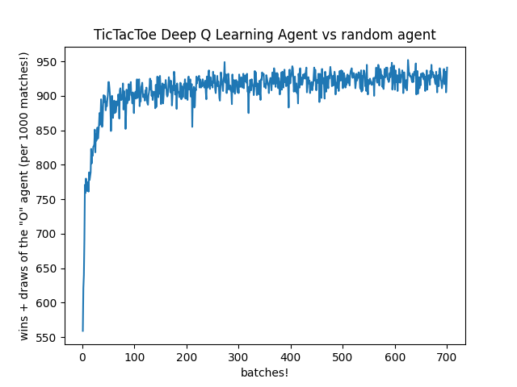

# Python-Simple-Neural-Network
It is a NeuralNetwork library build with a C backend, great for classification problems and it has some reinforcement learning agents good for games (examples below).
 
Its very easy to use, (no external librarys needed, not even numpy, just the build in 'math' and 'random' for python).
 
The C backend is using built in librarys like stdio, math etc... and a hashmap library from this repository.

 
Requirements!
 
This version is supported by any Python 3.x x64 version.
 
GCC (x86_64-posix-seh-rev0, Built by MinGW-W64 project) > 8.1.0 (It might work with other types of GCC aswell).
 
 
While it might be a python library it can be used in C aswell (See MainXOR.c for the XOR problem solved with the neural network).

Here is an example of TICTACTOE bot implemented with the help of this library and its Q learning methods.

